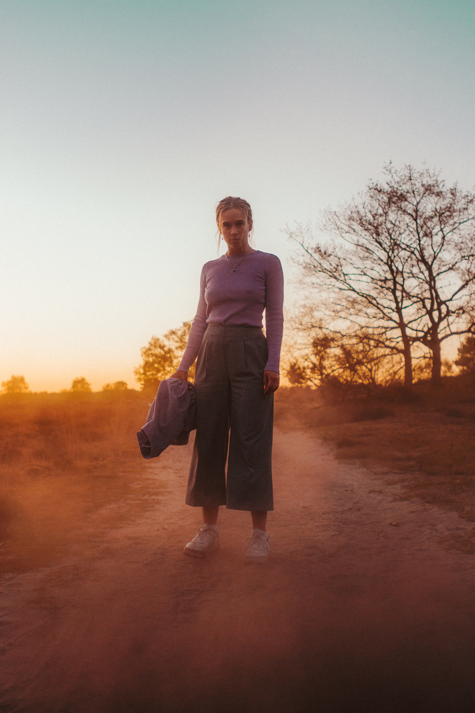

# The spectacle before us was indeed sublime.

Apparently we had reached a great height in the atmosphere, for the sky was a dead black, and the stars had ceased to twinkle. By the same illusion which lifts the horizon of the sea to the level of the spectator on a hillside, the sable cloud beneath was dished out, and the car seemed to float in the middle of an immense dark sphere, whose upper half was strewn with silver. Looking down into the dark gulf below, I could see a ruddy light streaming through a rift in the clouds.

Apparently we had reached a great height in the atmosphere, for the sky was a dead black, and the stars had ceased to twinkle. By the same illusion which lifts the horizon of the sea to the level of the spectator on a hillside, the sable cloud beneath was dished out, and the car seemed to float in the middle of an immense dark sphere, whose upper half was strewn with silver. Looking down into the dark gulf below, I could see a ruddy light streaming through a rift in the clouds.

## Second paragrapgh

<a style="background-color:black;color:white;text-decoration:none;padding:4px 6px;font-family:-apple-system, BlinkMacSystemFont, &quot;San Francisco&quot;, &quot;Helvetica Neue&quot;, Helvetica, Ubuntu, Roboto, Noto, &quot;Segoe UI&quot;, Arial, sans-serif;font-size:12px;font-weight:bold;line-height:1.2;display:inline-block;border-radius:3px" href="https://unsplash.com/@levi_stute_cinematography?utm_medium=referral&amp;utm_campaign=photographer-credit&amp;utm_content=creditBadge" target="_blank" rel="noopener noreferrer" title="Download free do whatever you want high-resolution photos from Levi Stute"><svg xmlns="http://www.w3.org/2000/svg" style="height:12px;width:auto;position:relative;vertical-align:middle;top:-2px;fill:white" viewBox="0 0 32 32"><title>unsplash-logo</title><path d="M10 9V0h12v9H10zm12 5h10v18H0V14h10v9h12v-9z"></path></svg>Levi Stute</a>

Apparently we had reached a great height in the atmosphere, for the sky was a dead black, and the stars had ceased to twinkle. By the same illusion which lifts the horizon of the sea to the level of the spectator on a hillside, the sable cloud beneath was dished out, and the car seemed to float in the middle of an immense dark sphere, whose upper half was strewn with silver. Looking down into the dark gulf below, I could see a ruddy light streaming through a rift in the clouds.

Apparently we had reached a great height in the atmosphere, for the sky was a dead black, and the stars had ceased to twinkle. By the same illusion which lifts the horizon of the sea to the level of the spectator on a hillside, the sable cloud beneath was dished out, and the car seemed to float in the middle of an immense dark sphere, whose upper half was strewn with silver. Looking down into the dark gulf below, I could see a ruddy light streaming through a rift in the clouds.
